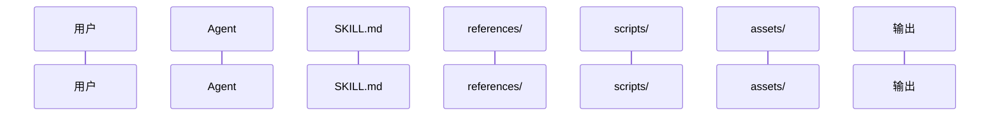
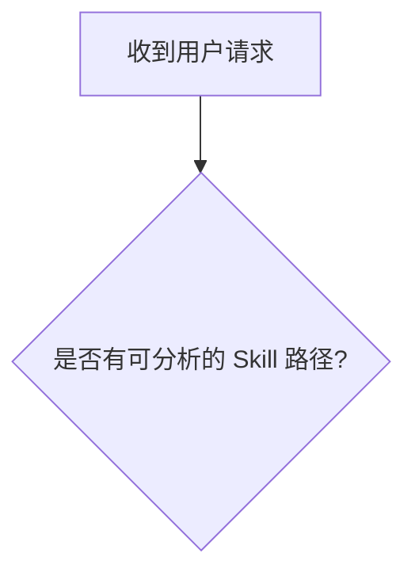

# Output Template

Use this structure for the analysis document. Default path: `analysis/howSkills.md` under the analyzed Skill's project or directory, unless the user provides another path.

## 电梯演讲

用一句话说明这个 Skill 的核心价值主张。分析完成后再回填到文档最开头。

## 第一阶段：Skill 结构扫描

- 目标路径：
- 文件结构：
- 资源统计：
- 初步类型判断：轻量知识型 / 流程编排型 / 工具集成型 / 混合型
- 类型判断证据：

## 第二阶段：真实痛点挖掘

### 场景还原

- 目标用户：
- 触发场景：
- 没有该 Skill 时的替代做法与麻烦：
- 该 Skill 真正解决的痛点层次：
- 该 Skill 不解决的问题：

### 痛点细化

| # | 痛点描述 | Skill 中对应的解法线索 | 证据 |
|---|----------|----------------------|------|
| 1 | ... | ... | ... |
| 2 | ... | ... | ... |
| 3 | ... | ... | ... |

## 第三阶段：工作流程可视化

### 用户交互时序图

### 核心工作流程图

如省略流程图，说明省略原因。

## 第四阶段：Scripts 脚本设计拆解

如无脚本，写明“该 Skill 不包含脚本，本阶段跳过”，并分析这是否合理。

| 脚本文件 | 核心功能 | 是否单一职责 | 输入输出是否清晰 | 可复用性评估 |
|----------|----------|-------------|------------------|-------------|
| ... | ... | ... | ... | ... |

- 场景覆盖：
- 边界处理：
- 调用关系：
- 确定性价值：
- 覆盖盲区：

## 第五阶段：References 参考文档设计拆解

如无 references，写明“该 Skill 不包含 references，本阶段跳过”，并分析这是否合理。

| 文件 | 内容类型 | 触发加载的场景 | 若缺失会怎样 |
|------|----------|---------------|-------------|
| ... | ... | ... | ... |

- 知识分层设计：
- 渐进式披露实践：
- 上下文效率评价：

## 第六阶段：Assets 资产设计拆解

如无 assets，写明“该 Skill 不包含 assets，本阶段跳过”，并分析这是否合理。

- 资产用途：
- 被读取还是被直接使用/输出：
- 解决的重复问题：
- 资产缺失影响：

## 第七阶段：独特解法提炼

**解法 1：[产品化命名]**

- 通用做法：
- Skill 的做法：
- 设计巧思：
- 适用边界：
- 证据：

至少尝试 3 个。若不足 3 个，明确说明原因。

### 设计模式归纳

- 模式名称：
- 模式定义：
- 可迁移场景：

## 第八阶段：综合评估与最佳实践总结

| 维度 | 评分（1-5） | 简评 | 证据 |
|------|------------|------|------|
| 触发质量 | ... | ... | ... |
| 流程质量 | ... | ... | ... |
| 输出质量 | ... | ... | ... |
| 经验密度 | ... | ... | ... |
| 资源组织质量 | ... | ... | ... |
| 自动化质量 | ... | ... | ... |
| 可维护性 | ... | ... | ... |
| 可评测性 | ... | ... | ... |

### 可迁移最佳实践

1. ...
2. ...
3. ...

### 潜在改进空间

- ...

## 自检结果

按 `references/self-check.md` 检查，并记录未满足项与原因。
